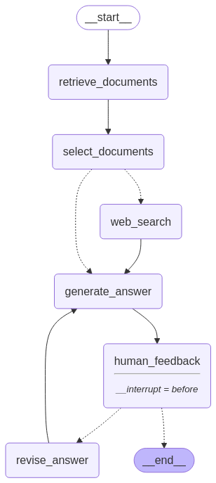

# LangGraph RAG 🚀

**LangGraph RAG** is a Retrieval-Augmented Generation (RAG) system that enhances language models with external data retrieval capabilities. This project leverages LangGraph to create dynamic and context-aware responses by integrating retrieved information into the generation process.

## Features ✨

- **Retrieval-Augmented Generation (RAG):** Combines the strengths of retrieval-based and generation-based models to produce accurate and contextually relevant responses.
- **LangGraph Integration:** Utilizes LangGraph for constructing and managing complex language model workflows.
- **Vectorstore Factory:** Supports both **ChromaDB** and **Qdrant**, allowing flexible vector storage configurations on a local machine.
- **Document Ingestion & Search:** Includes scripts to ingest documents into the vector store and perform test searches.
- **Modular Architecture:** Designed with modularity in mind, allowing easy customization and extension of components.
- **Interactive Command-Line Interface (CLI):** Provides a user-friendly CLI for interacting with the system.
- **LangGraph Studio Compatibility:** Seamlessly integrates with LangGraph Studio for visualizing and managing the graph flow.

## Installation 🛠️

To set up LangGraph RAG on your local machine, follow these steps:

1. **Install Poetry:**

   ```bash
   brew install poetry
   ```

2. **Initialize the Project:**

   ```bash
   poetry init
   ```

3. **Install Dependencies:**

   ```bash
   poetry add langchain python-dotenv beautifulsoup4 black tiktoken unstructured nltk fastapi jinja2 uvicorn streamlit streamlit-chat tqdm langchain-ollama langchain-qdrant langchain-community langchain-chroma pytest tavily-python langgraph
   ```

4. **Locate the Virtual Environment Path:**

   ```bash
   poetry env info --path
   ```

## Usage 🚀

After installation, you can interact with LangGraph RAG via the command line:

1. **Activate the Virtual Environment:**

   ```bash
   source $(poetry env info --path)/bin/activate
   ```

2. **Run the Main Script:**

   ```bash
   python main.py
   ```

This will launch the CLI, allowing you to input queries and receive responses generated by the RAG system.

## Vectorstore & Document Ingestion 📚

This project includes a **vectorstore factory**, allowing you to configure and use **ChromaDB** or **Qdrant** for storing embeddings locally.

To ingest and search documents in the vectorstore, use the scripts available in the [`vectorstore`](https://github.com/diogoaltoe/langgraph-rag/tree/main/vectorstore) directory:

- **`ingestion.py`** - Ingests documents into the vectorstore.
- **`search.py`** - Tests searching within the vectorstore to retrieve relevant documents.

## Graph Flow Overview 🔄

The system's workflow can be visualized as follows:

1. **Input Processing:** User inputs are processed and tokenized.
2. **Retrieval:** Relevant documents or data are retrieved based on the input.
3. **Augmentation:** Retrieved data is integrated into the context.
4. **Generation:** The language model generates a response using the augmented context.
5. **Output:** The generated response is presented to the user.



This flow ensures that the system produces informed and contextually relevant outputs.

## Running with LangGraph Studio 🖥️

To visualize and manage the graph flow using LangGraph Studio:

1. **Launch LangGraph Studio:** Ensure LangGraph Studio is installed and running on your system.
2. **Load the Project:** Open the LangGraph RAG project within the studio.
3. **Visualize the Workflow:** Use the studio's interface to explore and modify the graph flow as needed.

This integration allows for intuitive management and customization of the system's workflow.

## Contributing 🤝

Contributions are welcome! To contribute:

1. **Fork the Repository:** Click on the 'Fork' button at the top of the repository page.
2. **Clone Your Fork:** Clone your forked repository to your local machine.

   ```bash
   git clone https://github.com/your-username/langgraph-rag.git
   ```

3. **Create a New Branch:** Create a new branch for your feature or bug fix.

   ```bash
   git checkout -b feature-name
   ```

4. **Make Changes:** Implement your changes or additions.
5. **Commit Changes:** Commit your changes with a descriptive message.

   ```bash
   git commit -m "Add feature: description"
   ```

6. **Push to GitHub:** Push your changes to your forked repository.

   ```bash
   git push origin feature-name
   ```

7. **Submit a Pull Request:** Navigate to the original repository and submit a pull request.

Please ensure your contributions adhere to the project's coding standards and guidelines.

## License 📄

This project is licensed under the Apache-2.0 License. See the [LICENSE](LICENSE) file for more details.

## Acknowledgments 👏

Special thanks to the [LangGraph](https://github.com/langchain-ai/langgraph) team for their invaluable framework and tools that made this project possible.